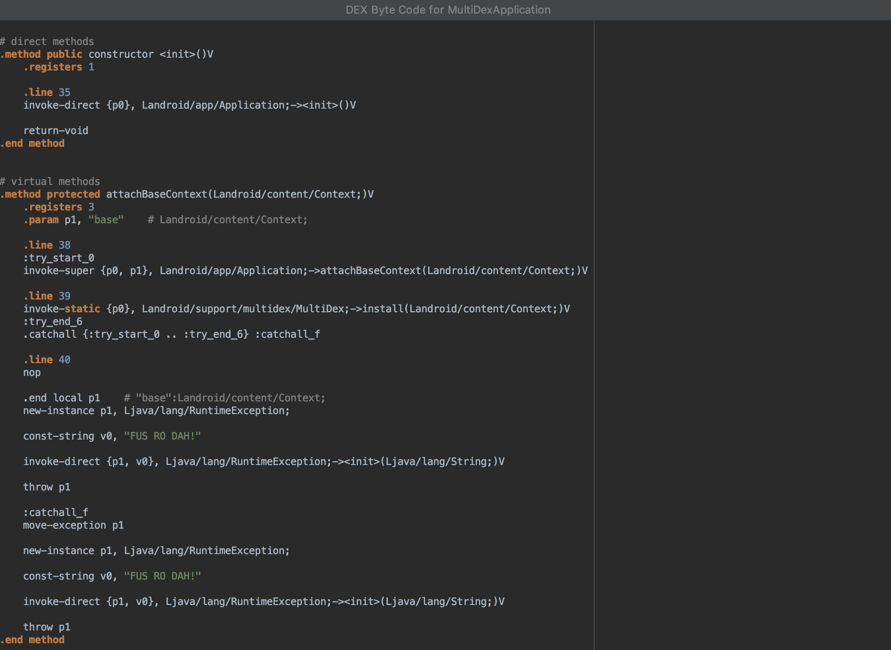

# Fus Ro Dah!

**Toy project** to see the transform API of gradle.

## What is this

This projects simply grabs all classes across the application on compile time and adds a `throw new RuntimeException("Fus Ro Dah!")` at the end of the method (with a finally block)

On a future iteration (using incremental compilation / variant aware caches / update tasks / etc) my aim would be to:
- Inject code that checks if an application is in debug mode
- Inject code that checks if an application is an emulator
- Inject code that checks if an application was signed by us.
- Inject code that checks if an application is tampered
  * Swap to a background thread, saving this class name + method name + metadata on a constant.
  * Throw an exception and catch it immediately
  * Check through the stacktrace compiled code matches runtime code.
  * Be aware future transformations could occur after this one, so we should be the last one somehow.
- We should only inject code on a random % of classes of the project to not affect performance heavily.
- Inect code that checks X more stuff.

Checking in de-centralized places with 'hardcoded code' allows us to not let the 'attacker' simply remove references from a centralized place, thus stubbing the whole check.

## Usage

Since it's a toy project, there's no published package. Simply grab the `fusrodah.jar` and place it somewhere accessible to your repository.

From your root `build.gradle` add:

```gradle
buildscript {
    dependencies {
        classpath files('relative/to/this/path/fusrodah.jar')

        // Add any dependency we have here and you dont have in your classpath. Eg:
        classpath "org.javassist:javassist:3.23.1-GA"
        // Also be sure to have at least android build tools version 3.2.1
    }
}
```

Apply it to your application's `build.gradle`:

```gradle
apply plugin: 'com.android.application' // You should already have this
apply plugin: com.saantiaguilera.gradle.plugin.fusrodah.FusRoDahPlugin
```

## Result

Simply compiling should output the `.apk`, but all the methods should be stubbed at the end.

See for example the class `MultiDexApplication` from the support library. At the end of the `#attachBaseContext` method you will see a throw of a `RuntimeException` saying `"Fus Ro Dah!"`

